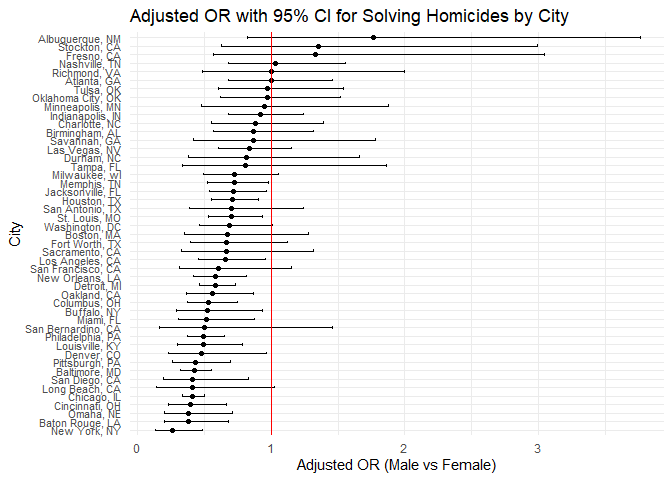
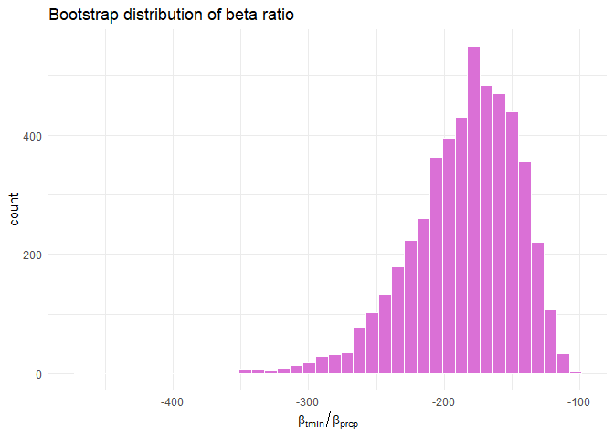
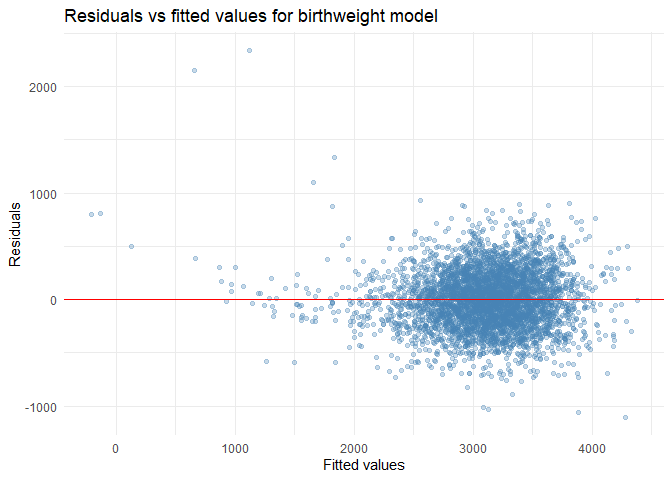

P8105 Homework 6
================
2025-11-27 Hantang Qin

------------------------------------------------------------------------

## Problem 1

### Data cleaning

``` r
homicide_df = 
  read.csv("homicide-data.csv") %>% 
janitor::clean_names() %>% 
  mutate(
    city_state = paste(city , state, sep = ", "),
    solve_status = case_match(
      disposition,
      "Closed without arrest" ~ 0,
      "Open/No arrest" ~ 0,
      "Closed by arrest" ~ 1
    ),
    victim_age = as.numeric(victim_age)
  ) %>% 
  filter(
    !(city_state %in% c("Dallas, TX", "Phoenix, AZ",  "Kansas City, MO", "Tulsa, AL")),
    victim_race %in% c("White", "Black")
  ) 
```

### Baltimore: logistic regression and adjusted OR (male vs female)

``` r
homicides_md =
  homicide_df %>%  
  filter(
    city_state == "Baltimore, MD"
  )

fit_md = 
  homicides_md |> 
  glm(
    solve_status ~ victim_age + victim_sex + victim_race, 
    family = binomial(), 
    data = _) 
```

``` r
result =
  broom::tidy(fit_md, conf.int = TRUE, exponentiate = TRUE)
result %>%  
  knitr::kable()
```

| term             |  estimate | std.error | statistic |   p.value |  conf.low | conf.high |
|:-----------------|----------:|----------:|----------:|----------:|----------:|----------:|
| (Intercept)      | 1.3633992 | 0.1712948 |  1.809635 | 0.0703525 | 0.9757573 | 1.9107826 |
| victim_age       | 0.9932953 | 0.0033235 | -2.024124 | 0.0429574 | 0.9868059 | 0.9997539 |
| victim_sexMale   | 0.4255117 | 0.1381762 | -6.183864 | 0.0000000 | 0.3241908 | 0.5575508 |
| victim_raceWhite | 2.3204389 | 0.1747162 |  4.817851 | 0.0000015 | 1.6496269 | 3.2759334 |

``` r
result %>%  
  filter(term == "victim_sexMale") |> 
  select(term, estimate, conf.low, conf.high) |> 
  knitr::kable()
```

| term           |  estimate |  conf.low | conf.high |
|:---------------|----------:|----------:|----------:|
| victim_sexMale | 0.4255117 | 0.3241908 | 0.5575508 |

Interpreting the exponentiated logistic regression coefficient, the odds
ratio for male versus female victims is about 0.42, meaning that, after
adjusting for the other variables, male victims have roughly 58% lower
odds of having their homicide solved than female victims. The
corresponding 95% confidence interval for this odds ratio is
approximately 0.32 to 0.56.

### Fit models for all cities and extract ORs

``` r
fit_cities = function(df){
  glm(
    solve_status ~ victim_age + victim_sex + victim_race, 
    family = binomial(link = "logit"), 
    data = df) 
}


w_results = 
  homicide_df %>% 
  nest(data = -city_state) %>% 
  mutate(
    fits = purrr::map(data, fit_cities),
    results = purrr::map(fits, ~broom::tidy(.x, conf.int = TRUE, exponentiate = TRUE))

  ) %>%  
  select(city_state, results) %>% 
  unnest(results) %>%  
  filter(term == "victim_sexMale") %>% 
  select(city_state, estimate, conf.low, conf.high) 


knitr::kable(w_results)
```

| city_state         |  estimate |  conf.low | conf.high |
|:-------------------|----------:|----------:|----------:|
| Albuquerque, NM    | 1.7674995 | 0.8247081 | 3.7618600 |
| Atlanta, GA        | 1.0000771 | 0.6803477 | 1.4582575 |
| Baltimore, MD      | 0.4255117 | 0.3241908 | 0.5575508 |
| Baton Rouge, LA    | 0.3814393 | 0.2043481 | 0.6836343 |
| Birmingham, AL     | 0.8700153 | 0.5713814 | 1.3138409 |
| Boston, MA         | 0.6739912 | 0.3534469 | 1.2768225 |
| Buffalo, NY        | 0.5205704 | 0.2884416 | 0.9358300 |
| Charlotte, NC      | 0.8838976 | 0.5507440 | 1.3905954 |
| Chicago, IL        | 0.4100982 | 0.3361233 | 0.5008546 |
| Cincinnati, OH     | 0.3998277 | 0.2313767 | 0.6670456 |
| Columbus, OH       | 0.5324845 | 0.3770457 | 0.7479124 |
| Denver, CO         | 0.4790620 | 0.2327380 | 0.9624974 |
| Detroit, MI        | 0.5823472 | 0.4619454 | 0.7335458 |
| Durham, NC         | 0.8123514 | 0.3824420 | 1.6580169 |
| Fort Worth, TX     | 0.6689803 | 0.3935128 | 1.1211603 |
| Fresno, CA         | 1.3351647 | 0.5672553 | 3.0475080 |
| Houston, TX        | 0.7110264 | 0.5569844 | 0.9057376 |
| Indianapolis, IN   | 0.9187284 | 0.6784616 | 1.2413059 |
| Jacksonville, FL   | 0.7198144 | 0.5359236 | 0.9650986 |
| Las Vegas, NV      | 0.8373078 | 0.6058830 | 1.1510854 |
| Long Beach, CA     | 0.4102163 | 0.1427304 | 1.0241775 |
| Los Angeles, CA    | 0.6618816 | 0.4565014 | 0.9541036 |
| Louisville, KY     | 0.4905546 | 0.3014879 | 0.7836391 |
| Memphis, TN        | 0.7232194 | 0.5261210 | 0.9835973 |
| Miami, FL          | 0.5152379 | 0.3040214 | 0.8734480 |
| Milwaukee, wI      | 0.7271327 | 0.4951325 | 1.0542297 |
| Minneapolis, MN    | 0.9469587 | 0.4759016 | 1.8809745 |
| Nashville, TN      | 1.0342379 | 0.6807452 | 1.5559966 |
| New Orleans, LA    | 0.5849373 | 0.4218807 | 0.8121787 |
| New York, NY       | 0.2623978 | 0.1327512 | 0.4850117 |
| Oakland, CA        | 0.5630819 | 0.3637421 | 0.8671086 |
| Oklahoma City, OK  | 0.9740747 | 0.6228507 | 1.5199721 |
| Omaha, NE          | 0.3824861 | 0.1988357 | 0.7109316 |
| Philadelphia, PA   | 0.4962756 | 0.3760120 | 0.6498797 |
| Pittsburgh, PA     | 0.4307528 | 0.2626022 | 0.6955518 |
| Richmond, VA       | 1.0060520 | 0.4834671 | 1.9936248 |
| San Antonio, TX    | 0.7046200 | 0.3928179 | 1.2382509 |
| Sacramento, CA     | 0.6688418 | 0.3262733 | 1.3143888 |
| Savannah, GA       | 0.8669817 | 0.4185827 | 1.7802453 |
| San Bernardino, CA | 0.5003444 | 0.1655367 | 1.4623977 |
| San Diego, CA      | 0.4130248 | 0.1913527 | 0.8301847 |
| San Francisco, CA  | 0.6075362 | 0.3116925 | 1.1551470 |
| St. Louis, MO      | 0.7031665 | 0.5298505 | 0.9319005 |
| Stockton, CA       | 1.3517273 | 0.6256427 | 2.9941299 |
| Tampa, FL          | 0.8077029 | 0.3395253 | 1.8598834 |
| Tulsa, OK          | 0.9757694 | 0.6090664 | 1.5439356 |
| Washington, DC     | 0.6901713 | 0.4653608 | 1.0122516 |

### Plot of ORs and CIs by city

``` r
w_results %>%
  mutate(city_state = fct_reorder(city_state, estimate)) %>%
  ggplot(aes(x = city_state, y = estimate)) +
  geom_point() +
  geom_errorbar(aes(ymin = conf.low, ymax = conf.high), width = 0.3) +
  geom_hline(yintercept = 1, color = "red", linewidth = 0.4) +
  coord_flip() +
  labs(
    x = "City",
    y = "Adjusted OR (Male vs Female)",
    title = "Adjusted OR with 95% CI for Solving Homicides by City"
  ) +
  theme_minimal() +
  theme(
    axis.text.y = element_text(size = 8, margin = margin(r = 4))
  )
```

<!-- -->

From the plot, the reference line at OR = 1 helps show which sex is more
likely to have their case solved. In cities like Albuquerque, Stockton,
Fresno, and Nashville, the ORs are above 1, suggesting that homicides
involving male victims are more likely to be solved, although the wide
confidence intervals there mean these estimates are quite uncertain. In
cities where the 95% confidence interval crosses 1, we don’t have strong
statistical evidence that clearance rates differ by victim sex. By
contrast, in cities such as Memphis, Jacksonville, Houston, New Orleans,
Detroit, Oakland, and New York, the ORs are below 1 and their confidence
intervals stay below 1, indicating that cases with female victims are
more likely to be solved than those with male victims.

------------------------------------------------------------------------

## Problem 2

``` r
set.seed(123)

data("weather_df")

# function to draw a bootstrap sample
boot_sample = function(df) {
  df %>% sample_frac(replace = TRUE)
}

# function to compute the beta ratio for specified terms
beta_ratio_fun = function(tidy_df, b1 = "tmin", b2 = "prcp") {
  b1_hat = tidy_df %>% filter(term == b1) %>% pull(estimate)
  b2_hat = tidy_df %>% filter(term == b2) %>% pull(estimate)
  as.numeric(b1_hat / b2_hat)
}
```

### Bootstrap procedure

``` r
n_boot = 5000

boot_results = 
  tibble(iter = 1:n_boot) %>% 
  mutate(
    boot_df = map(iter, function(i) boot_sample(weather_df)),
    model   = map(boot_df, function(df) lm(tmax ~ tmin + prcp, data = df)),
    glance  = map(model, glance),
    tidy    = map(model, tidy),
    r2        = map_dbl(glance, "r.squared"),
    beta_ratio = map_dbl(tidy, beta_ratio_fun)
  ) %>% 
  select(iter, r2, beta_ratio)

head(boot_results)
```

    ## # A tibble: 6 × 3
    ##    iter    r2 beta_ratio
    ##   <int> <dbl>      <dbl>
    ## 1     1 0.940      -142.
    ## 2     2 0.941      -248.
    ## 3     3 0.940      -147.
    ## 4     4 0.943      -179.
    ## 5     5 0.938      -143.
    ## 6     6 0.941      -191.

### Distribution of R² and beta ratio

``` r
r2_plot = 
  boot_results %>% 
  ggplot(aes(x = r2)) +
  geom_histogram(
    bins  = 40,
    fill  = "skyblue",
    color = "white"
  ) +
  labs(
    x = "R²",
    title = "Bootstrap distribution of R²"
  ) +
  theme_minimal()

br_plot = 
  boot_results %>% 
  ggplot(aes(x = beta_ratio)) +
  geom_histogram(
    bins  = 40,
    fill  = "orchid",
    color = "white"
  ) +
  labs(
    x = expression(beta[tmin] / beta[prcp]),
    title = "Bootstrap distribution of beta ratio"
  ) +
  theme_minimal()

r2_plot
```

<!-- -->

``` r
br_plot
```

<!-- -->

### Bootstrap confidence intervals

``` r
boot_ci = 
  boot_results %>% 
  summarise(
    r2_low   = quantile(r2, 0.025),
    r2_high  = quantile(r2, 0.975),
    br_low   = quantile(beta_ratio, 0.025),
    br_high  = quantile(beta_ratio, 0.975)
  )

boot_ci
```

    ## # A tibble: 1 × 4
    ##   r2_low r2_high br_low br_high
    ##    <dbl>   <dbl>  <dbl>   <dbl>
    ## 1  0.934   0.947  -279.   -125.

The bootstrap distribution of R² is roughly symmetric and bell-shaped
(maybe slightly left-skewed). Overall it looks reasonably close to
normal. The distribution of the beta ratio is highly skewed with a sharp
peak and a long tail. This clearly doesn’t look normal, so a
normal-based approximation for the beta ratio would be questionable.

------------------------------------------------------------------------

## Problem 3

### Data cleaning

``` r
birthweight_raw = 
  read_csv("https://p8105.com/data/birthweight.csv")

bw_df = 
  birthweight_raw %>% 
  janitor::clean_names() %>% 
  mutate(
    babysex = factor(babysex, labels = c("male", "female")),
    malform = factor(malform, labels = c("absent", "present")),
    frace   = factor(frace),
    mrace   = factor(mrace)
  ) %>% 
  drop_na()
```

Check imbalance in some binary / count variables:

``` r
bw_df %>%
select(parity, pnumlbw, pnumsga) %>%
pivot_longer(
everything(),
names_to  = "variable",
values_to = "value"
) %>%
group_by(variable) %>%
summarise(
prop_zero = mean(value == 0)
)
```

    ## # A tibble: 3 × 2
    ##   variable prop_zero
    ##   <chr>        <dbl>
    ## 1 parity       0.999
    ## 2 pnumlbw      1    
    ## 3 pnumsga      1

These variables are almost always zero and don’t add much information,
so I’ll remove them:

``` r
bw_df =
  bw_df %>%
  select(-any_of(c("parity", "pnumlbw", "pnumgsa", "pnumsga")))
```

Quick look at numeric variables:

``` r
bw_df %>% 
  select(where(is.numeric)) %>% 
  pivot_longer(
    everything(),
    names_to  = "variable",
    values_to = "value"
  ) %>% 
  ggplot(aes(x = value)) +
  geom_histogram(
    bins = 30,
    fill = "lightgray",
    color = "white"
  ) +
  facet_wrap(~ variable, scales = "free") +
  theme_bw()
```

<!-- -->

### Proposed model for birthweight

``` r
mod_main = 
  lm(
    bwt ~ blength + bhead + gaweeks + delwt + 
      babysex + mheight + mrace + wtgain + smoken,
    data = bw_df
  )

summary(mod_main)
```

    ## 
    ## Call:
    ## lm(formula = bwt ~ blength + bhead + gaweeks + delwt + babysex + 
    ##     mheight + mrace + wtgain + smoken, data = bw_df)
    ## 
    ## Residuals:
    ##      Min       1Q   Median       3Q      Max 
    ## -1104.52  -183.71    -2.92   174.58  2336.55 
    ## 
    ## Coefficients:
    ##                 Estimate Std. Error t value Pr(>|t|)    
    ## (Intercept)   -6090.6410   137.5628 -44.275  < 2e-16 ***
    ## blength          74.7285     2.0187  37.018  < 2e-16 ***
    ## bhead           131.1745     3.4460  38.065  < 2e-16 ***
    ## gaweeks          11.4086     1.4579   7.825 6.32e-15 ***
    ## delwt             1.4327     0.2321   6.173 7.30e-10 ***
    ## babysexfemale    28.9272     8.4577   3.420 0.000631 ***
    ## mheight           6.8133     1.7803   3.827 0.000132 ***
    ## mrace2         -145.4960     9.2303 -15.763  < 2e-16 ***
    ## mrace3          -78.1687    42.3138  -1.847 0.064764 .  
    ## mrace4         -106.5370    19.1169  -5.573 2.66e-08 ***
    ## wtgain            2.6726     0.4274   6.253 4.40e-10 ***
    ## smoken           -4.8782     0.5858  -8.327  < 2e-16 ***
    ## ---
    ## Signif. codes:  0 '***' 0.001 '**' 0.01 '*' 0.05 '.' 0.1 ' ' 1
    ## 
    ## Residual standard error: 272.5 on 4330 degrees of freedom
    ## Multiple R-squared:  0.7175, Adjusted R-squared:  0.7168 
    ## F-statistic: 999.9 on 11 and 4330 DF,  p-value: < 2.2e-16

### Residual diagnostics

``` r
bw_df %>% 
  add_predictions(mod_main) %>% 
  add_residuals(mod_main) %>% 
  ggplot(aes(x = pred, y = resid)) +
  geom_point(alpha = 0.3, color = "steelblue") +
  geom_hline(yintercept = 0, color = "red") +
  labs(
    x = "Fitted values",
    y = "Residuals",
    title = "Residuals vs fitted values for birthweight model"
  ) +
  theme_minimal()
```

<!-- -->

To build a regression model for birthweight, I first looked for
predictors that either had serious imbalance (for example, variables
that were almost always zero) or were clearly redundant. Variables such
as `parity`, `pnumlbw`, and `pnumgsa` were extremely sparse, so I
removed them.

Then, based on both domain knowledge and exploratory plots, I included
predictors that are biologically or clinically connected to birthweight:
gestational age (`gaweeks`), baby’s length and head circumference at
birth (`blength`, `bhead`), maternal delivery weight and height
(`delwt`, `mheight`), maternal weight gain (`wtgain`), smoking during
pregnancy (`smoken`), baby’s sex (`babysex`), and mother’s race
(`mrace`).

The residual plot shows residuals centered around zero with no obvious
strong pattern. The spread of residuals gets somewhat larger for higher
fitted values, suggesting some mild heteroskedasticity, but nothing
extreme.

------------------------------------------------------------------------

### Model comparison via cross–validation

1.  **Model 1 (my chosen model)**
    `bwt ~ blength + bhead + gaweeks + delwt + babysex + mheight + mrace + wtgain + smoken`

2.  **Model 2 (simple model)** `bwt ~ blength + gaweeks`

3.  **Model 3 (interaction–heavy model)**
    `bwt ~ bhead * blength * babysex`

``` r
set.seed(234)

cv_df = 
  crossv_mc(bw_df, n = 100) %>% 
  mutate(
    train = map(train, as_tibble),
    test  = map(test,  as_tibble)
  ) %>% 
  mutate(
    m1 = map(
      train,
      function(df) {
        lm(
          bwt ~ blength + bhead + gaweeks + delwt + 
            babysex + mheight + mrace + wtgain + smoken,
          data = df
        )
      }
    ),
    m2 = map(
      train,
      function(df) {
        lm(
          bwt ~ blength + gaweeks,
          data = df
        )
      }
    ),
    m3 = map(
      train,
      function(df) {
        lm(
          bwt ~ bhead * blength * babysex,
          data = df
        )
      }
    )
  ) %>% 
  mutate(
    rmse_m1 = map2_dbl(m1, test, function(mod, df) rmse(model = mod, data = df)),
    rmse_m2 = map2_dbl(m2, test, function(mod, df) rmse(model = mod, data = df)),
    rmse_m3 = map2_dbl(m3, test, function(mod, df) rmse(model = mod, data = df))
  )
```

### RMSE comparison

``` r
cv_df %>% 
  select(starts_with("rmse_")) %>% 
  pivot_longer(
    everything(),
    names_to  = "model",
    values_to = "rmse",
    names_prefix = "rmse_"
  ) %>% 
  mutate(model = fct_inorder(model)) %>% 
  ggplot(aes(x = model, y = rmse)) +
  geom_violin(fill = "skyblue", color = "gray30") +
  labs(
    x = "Model",
    y = "RMSE",
    title = "Cross–validated RMSE for three birthweight models"
  ) +
  theme_minimal()
```

<!-- -->

``` r
cv_df %>%
  summarize(
    RMSE_prop  = mean(rmse_m1),
    RMSE_Main  = mean(rmse_m2),
    RMSE_Inter = mean(rmse_m3)
  ) %>%
  knitr::kable(digits = 2)
```

| RMSE_prop | RMSE_Main | RMSE_Inter |
|----------:|----------:|-----------:|
|    273.54 |    334.19 |     289.01 |

The violin plot shows the RMSE distributions across 100 cross-validation
splits for each model. The proposed model (Model 1), which includes
fetal measurements, key maternal variables, and infant sex, has the
lowest average RMSE (273.54). The interaction model (Model 3) has a
higher average RMSE (289.01), and the simple model (Model 2) is worst
(334.19). This pattern suggests that the proposed model gives the best
predictive performance while keeping model complexity at a reasonable
level.
